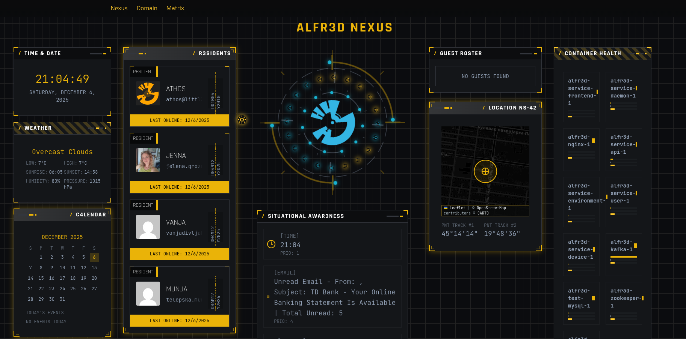
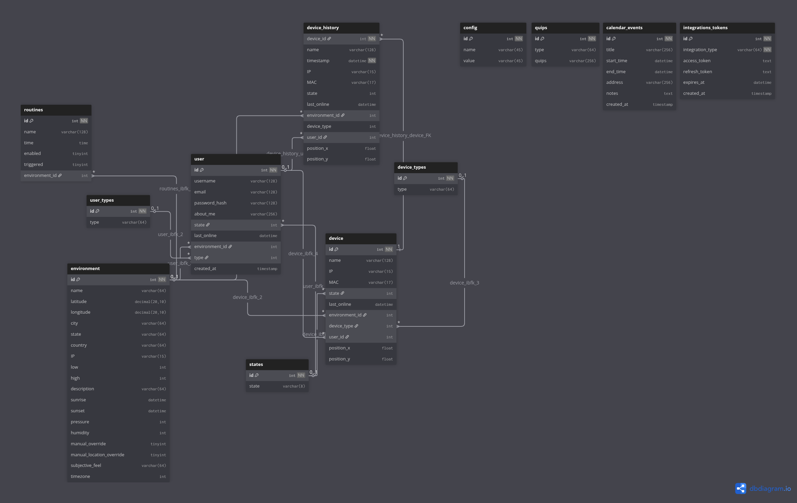

# ALFR3D

A containerized microservices project for home automation, featuring Kafka messaging, MySQL database, and Python services. Includes a modern React web frontend with real-time dashboard monitoring and comprehensive user/device management.

[](https://deepwiki.com/armageddion/alfr3d)

## Screenshot



## Database Architecture



## Features

- **Microservices Architecture**: Modular services for users, devices, environment, daemon, and frontend.
- **Optimized Performance**:
  - Vite with gzip/brotli compression for ~70% smaller bundles
  - Manual chunk splitting for parallel loading and better caching
  - React Query for client-side API caching (5-min stale time)
  - orjson for 3-10x faster JSON serialization
  - DBUtils connection pooling for database efficiency
  - Event-driven Kafka consumers for lower CPU usage
- **Real-Time Dashboard**: Live monitoring with CPU/memory metrics via HTTP polling (10s), health status, and animated connection lines.
- **Project Tree Visualization**: Interactive D3.js force-directed tree (1000x400px) showing the full project structure in the Nexus dashboard. Features animated swaying nodes, click-to-expand/collapse, auto-fit zoom, dark background matching tactical panel styling, and real-time updates when files change.
- **Messaging**: Kafka-based communication between services with topics: `speak`, `user`, `device`, `environment`, `event-stream`, `situational-awareness`, `integrations`. Includes text-to-speech audio generation.
- **Real-Time WebSocket**: Events, situational awareness, and audio updates via WebSocket (`/ws/` endpoint); container metrics use HTTP polling (10s).
- **IoT Integration**: Home Assistant and SmartThings device integration with unified API endpoints, periodic sync, and blueprint display with MAC-based device linking.
- **Routine Automation**: Time-based automation with recurrence options (daily, weekly, weekdays), action builder supporting speak, device, email, and scene actions.
- **Database**: MySQL with optimized, secure queries and comprehensive schema.
- **Security**: Parameterized SQL queries to prevent injection; password hashing; secure API endpoints.
- **Performance**: Optimized DB calls with batch updates, real-time metrics collection, and efficient data fetching.
- **Modern UI**: Dark theme with professional styling, responsive design, and intuitive navigation.
- **Testing**: Comprehensive unit tests, integration tests, and API endpoint testing.
- **Containerization**: Docker Compose for local development; Kubernetes manifests for production deployment.
- **Deployment**: Full Minikube support with ingress configuration and persistent storage.

## Services

- **Zookeeper**: Required for Kafka coordination and cluster management.
- **Kafka**: Message broker with auto-created topics (`speak`, `user`, `device`, `environment`, `event-stream`, `situational-awareness`, `integrations`) for inter-service communication.
- **MySQL**: Database with comprehensive schema including users, devices, environments, routines, and states.
- **Service Daemon**: Core orchestration service handling voice commands, Google integrations, situational awareness with event-based travel planning and gathering detection, and message routing.
- **Service User**: Manages user accounts, authentication, and online/offline status tracking.
- **Service Device**: Manages IoT devices, performs network scanning with arp-scan, and device state monitoring. Runs as a standalone container on the host machine for direct network access.
- **Service Environment**: Handles geolocation, weather updates, and environmental data collection.
- **Service API**: REST API gateway providing endpoints for users and container metrics, interfacing with database and Docker.
- **Service Frontend**: Modern React web application with real-time dashboard, user/device management, and control panel.
- **Service Speak**: Text-to-speech service generating audio from Kafka messages with real-time notifications.
- **IoT Integration**: Unified IoT layer supporting Home Assistant and SmartThings with automatic device syncing and blueprint visualization.

## Quick Start

### Local Development with Docker Compose

1. **Prerequisites**: Ensure Docker and Docker Compose are installed. For faster builds, enable BuildKit:
   ```bash
   export DOCKER_BUILDKIT=1
   ```

2. **Environment Setup**: Copy `.env.example` to `.env` and update environment variables (DB credentials, Kafka URLs).
3. **Start All Services**:
   ```bash
   ./setup/build_images.sh
   docker-compose up -d mysql
   docker-compose exec mysql mysql -u root -p${MYSQL_ROOT_PASSWORD} < setup/createTables.sql
   docker-compose up -d
   ```
4. **Access the Application**:
      - Dashboard: `http://localhost` (via nginx on port 80)

Note: Service Device runs as a standalone container for network scanning and should be deployed separately on the host machine.

### Running All Tests

```bash
# Install test dependencies
pip install -r tests/requirements.txt

# Run all tests
pytest tests/

# Run with coverage
pytest --cov=services/ tests/
```

### Test Categories

- **Integration Tests**: Kafka messaging between services (`test_kafka.py`)
- **Database Tests**: MySQL operations and data integrity (`test_mysql.py`)
- **Service Tests**: Individual service functionality
  - User service operations (`test_user_service.py`)
  - Device service network scanning (`test_device_service.py`)
  - Environment service data collection (`test_service_environment.py`)
- **Frontend Tests**: Dashboard API endpoints and real-time data updates

### Test Fixtures

- `kafka_bootstrap_servers`: Kafka connection configuration
- `mysql_config`: Database connection parameters
- Automatic service startup/teardown for integration tests

## Setup and Maintenance

The `setup/` directory contains scripts for database initialization, maintenance, and integration setup:

### Database Setup
- **`createTables.sql`**: Initial database schema creation with all tables, indexes, and triggers
- **`migration_001_calendar_cleanup.sql`**: Database migration for calendar cleanup functionality
- **`migration_002_iot.sql`**: Database migration for IoT integration (smarthome_devices table, MAC address linking)
- **`migration_003_routines.sql`**: Database migration for routine management (recurrence, actions JSON, last_run tracking)
- **`drop_cleanup_trigger.sql`**: Script to remove old cleanup triggers

### IoT Integration

ALFR3D supports integration with Home Assistant and SmartThings for unified smart home control:

#### Features
- **Unified Device Management**: View and control HA and ST devices from a single interface
- **Automatic Sync**: Devices sync automatically every 15 minutes via the daemon service
- **Blueprint Visualization**: Linked IoT devices appear on the floorplan with proper device type icons
- **Manual Device Linking**: Link IoT devices to alfr3d devices via Domain → Devices → SMARTHOME DEVICES section
- **Device Type Controls**: ControlBlade provides type-specific controls (lights, thermostats, locks, fans, covers, media players)
- **Sensor Display**: View sensor readings (temperature, humidity, battery) in ControlBlade
- **Linked Status**: Linked devices show "LINKED" in blue, unlinked show warning icon
- **FK Relationship**: smarthome_devices.device_id links to device table for type and position

#### Configuration
1. Configure Home Assistant via the Integrations page:
   - HA URL (e.g., `http://192.168.1.x:8123`)
   - Long-Lived Access Token

2. Configure SmartThings via the Integrations page:
   - Personal Access Token (PAT)

3. Set default provider in IoT settings

#### Linking Devices
1. Go to Domain → Devices tab
2. Scroll to "SMARTHOME DEVICES" section
3. Click the Link button (chain icon) on an unlinked device
4. Select an ALFR3D device to link to
5. The device will now appear on the Blueprint with proper icon and controls

#### Available Device Controls
- **Lights**: Power toggle, brightness slider
- **Switches**: Power toggle
- **Climate**: Temperature up/down, current/target display
- **Locks**: Lock/unlock toggle
- **Fans**: Power toggle, speed selector
- **Cover**: Position slider, open/close buttons
- **Media Players**: Play/pause, volume slider
- **Sensors**: Display readings (temperature, humidity, battery, etc.)

#### Database Schema
- **`smarthome_devices`**: Stores synced IoT devices with source (homeassistant/smartthings), entity IDs, MAC addresses, and device_id FK to device table
- **`device`**: Local device table stores linked devices with type from device_types
- **`device_types`**: Expanded to include fan, climate, cover, lock, media_player, sensor, binary_sensor, camera
- **`device_command_history`**: Tracks device control commands for audit logs

#### API Endpoints (Additional)
- `PUT /api/iot/devices/{id}/link`: Link/unlink IoT device to local device

#### Sync Mechanism
- Daemon sends Kafka messages (`iot_ha_sync`, `iot_st_sync`) every 15 minutes
- Device service fetches devices from HA/ST APIs and updates the database
- MAC addresses extracted from HA entity connections for device auto-linking
- On sync: looks up MAC in device table, sets device_id FK, or creates new device record if not found
- Frontend uses FK join for position data

### Routine Automation

ALFR3D supports time-based automation with the following features:

#### Features
- **Recurrence Options**: Run routines once, daily, on weekdays, or weekly
- **Action Types**: Speak (TTS), device control, email, and scene activation
- **Manual Execution**: Run routines on-demand from the Matrix page
- **Action Builder**: Visual interface for creating multi-step routines

#### Supported Actions
- **Speak**: Text-to-speech messages via the speak service
- **Device**: Control IoT devices (on/off)
- **Email**: Send email notifications
- **Scene**: Activate device scenes

#### Configuration
1. Navigate to Matrix page in the frontend
2. Click "New Routine" to create a routine
3. Set time, recurrence, and add actions
4. Save and enable the routine

#### Database Schema
- **`routines`**: Stores routine definitions with name, time, recurrence (once/daily/weekdays/weekly), actions (JSON), and last_run timestamp

### Maintenance Scripts
- **`backup_db.sh`**: Automated database backup script
- **`cleanup_device_history.py`** / **`cleanup_device_history.sh`**: Scripts to clean up old device history data
- **`authorize_google.py`**: Google API authorization setup for Gmail and Calendar integrations

Run these scripts as needed for database maintenance, backups, and integration configuration.

## Linting

Run linting across all services:

```bash
./lint.sh
```

This runs `npm run lint` for the frontend service and flake8/black for Python services. Fix issues with:

For frontend:

```bash
cd services/service_frontend && npm run lint -- --fix
```

For Python services:

```bash
black services/service_api/app.py services/service_daemon/alfr3ddaemon.py services/service_daemon/daemon.py services/service_daemon/utils/ services/service_user/app.py services/service_device/app.py services/service_environment/environment.py services/service_environment/weather_util.py
```

## Pre-Commit Hooks

This project uses pre-commit hooks to ensure code quality before commits. The hooks are configured in `.pre-commit-config.yaml`.

### Setup

Install pre-commit if you haven't already:

```bash
pip install pre-commit
pre-commit install
```

### Running Hooks

Run all hooks on staged files:

```bash
pre-commit run
```

Run all hooks on all files:

```bash
pre-commit run --all-files
```

### Configured Hooks

| Hook | Purpose |
|------|---------|
| trailing-whitespace | Removes trailing whitespace |
| end-of-file-fixer | Ensures files end with newline |
| check-yaml | Validates YAML syntax |
| check-added-large-files | Prevents large file commits |
| black | Python code formatting (line-length=100) |
| flake8 | Python linting (max-line-length=100, ignores E203,W503,F401) |
| detect-secrets | Scans for committed secrets |

### E402 Workaround

Some imports must come after `sys.path.insert()` for Docker container path resolution. These use `# noqa: E402` comments to suppress false positives.

### Undefined json Fix

The codebase uses `orjson` instead of the standard `json` module. Ensure any JSON operations use `orjson.dumps()`/`orjson.loads()` and `orjson.JSONDecodeError`.

## Dashboard Features

The ALFR3D dashboard provides real-time monitoring and control:

### Real-Time Metrics
- **Live CPU/Memory**: Actual system resource usage for all services (HTTP polling every 10s)
- **Health Indicators**: Visual status (🟢 Healthy, 🟡 Warning, 🔴 Unhealthy)
- **Connection Lines**: Animated Kafka topic flows between services
- **Event Updates**: WebSocket-powered instant updates for events and situational awareness

### Management Interface
- **User Management**: Registration, editing, deletion with role-based access
- **Device Control**: Network scanning, device state monitoring
- **Environment Settings**: Location and weather data configuration
- **Routine Automation**: Time-based task management with speak, device, email, and scene actions

### Visual Design
- **Dark Theme**: Professional UI with consistent styling
- **Responsive Layout**: Works on desktop and mobile devices
- **Interactive Elements**: Hover effects and smooth animations
- **Navigation**: Unified nav bar across all pages

## Development

### Architecture Overview
- **Backend**: Flask-based microservices with Kafka messaging and REST API gateway
- **Frontend**: React application with real-time updates
- **Database**: MySQL with comprehensive schema
- **Deployment**: Docker Compose (dev) and Kubernetes (prod)

### Key Improvements
- **Real-Time Data**: Dashboard shows live metrics instead of static data
- **Security**: Parameterized SQL queries, secure API endpoints
- **Performance**: Optimized DB calls, efficient data fetching
- **UI/UX**: Modern dark theme, responsive design
- **Testing**: Comprehensive test coverage for all components
- **Deployment**: Full Kubernetes support with Minikube

### Development Workflow
1. Modify services in `services/` directories
2. Update tests in `tests/` directory
3. Run tests: `pytest tests/`
4. Lint code: `./lint.sh`
5. Rebuild: `docker-compose up --build`

### API Endpoints
- **Service API**:
  - `GET /api/users`: Retrieve online users
  - `GET /api/containers`: Retrieve container health metrics
  - `POST /api/users`: Create a new user
  - `PUT /api/users/<user_id>`: Update an existing user
  - `DELETE /api/users/<user_id>`: Delete a user
  - `GET /api/devices`: Retrieve devices
  - `POST /api/devices`: Create a new device
  - `PUT /api/devices/<device_id>`: Update an existing device
  - `DELETE /api/devices/<device_id>`: Delete a device
  - `GET /api/events`: Retrieve recent events
  - `GET /api/quips`: Retrieve quips
  - `POST /api/quips`: Create a new quip
  - `PUT /api/quips/<quip_id>`: Update an existing quip
  - `DELETE /api/quips/<quip_id>`: Delete a quip
  - `GET /api/weather`: Retrieve weather data
  - `GET /api/environment`: Retrieve environment data and override status
  - `PUT /api/environment`: Update environment data and override mode
  - `POST /api/environment/reset`: Reset to automatic detection
- `GET /api/situational-awareness`: Retrieve situational awareness data
- `GET /api/audio/<filename>`: Serve generated audio files
- `GET /api/project-tree`: Retrieve project directory tree structure for visualization
- `GET /api/integrations/status`: Check integration sync status
- `POST /api/integrations/sync/<type>`: Trigger integration sync (e.g., gmail, calendar)
- **IoT (Home Assistant/SmartThings)**:
  - `GET /api/iot/status`: Get connection status for HA and ST
  - `GET /api/iot/providers`: List available IoT providers
  - `PUT /api/iot/provider`: Set default IoT provider
  - `GET /api/iot/ha/status`: Home Assistant connection status
  - `GET /api/iot/ha/devices`: Get HA devices
  - `POST /api/iot/ha/devices/<entity_id>/control`: Control HA device
  - `PUT /api/iot/ha/config`: Configure HA (URL, token)
  - `POST /api/iot/ha/sync`: Trigger HA device sync
  - `GET /api/iot/st/status`: SmartThings connection status
  - `GET /api/iot/st/devices`: Get SmartThings devices
  - `POST /api/iot/st/devices/<device_id>/control`: Control ST device
  - `PUT /api/iot/st/config`: Configure ST (PAT)
  - `POST /api/iot/st/sync`: Trigger ST device sync
  - `GET /api/iot/devices`: Get all IoT devices (merged with local devices)
  - `POST /api/iot/devices/<device_id>/control`: Control IoT device
- **Routines**:
  - `GET /api/routines`: List all routines for current environment
  - `POST /api/routines`: Create a new routine
  - `PUT /api/routines/<id>`: Update an existing routine
  - `DELETE /api/routines/<id>`: Delete a routine
  - `POST /api/routines/<id>/run`: Manually execute a routine
- **WebSocket**:
  - `WS /ws/socket.io/`: Real-time events and situational awareness via SocketIO (port 5002)
- **Service Frontend**:
  - `GET /`: Landing page
  - `GET /dashboard`: Real-time monitoring dashboard
  - `GET /control`: Management interface

## Docker Deployment

### Build and Start Services

1. **Build all service images**:
   ```bash
   ./setup/build_images.sh
   ```

2. **Start all services**:
   ```bash
   docker-compose up -d
   ```

3. **Access the application**:
   - Via nginx: `http://localhost`

### Stop Services

```bash
docker-compose down
```

## Kubernetes Deployment

The project includes complete Kubernetes manifests for production deployment with Minikube support.

### Prerequisites
- Minikube installed and running
- kubectl configured
- Docker for building images

### Deploy to Minikube

1. **Start Minikube**:
   ```bash
   minikube start --driver=docker
   minikube update-context
   ```

2. **Build and Load Images**:
   ```bash
   # Build all service images using the provided script
   ./setup/build_images.sh
   eval $(minikube docker-env)
   docker tag alfr3d/service-frontend:v0.1.5 alfr3d/service-frontend:latest
   docker tag alfr3d/service-api:v0.1.5 alfr3d/service-api:latest
   docker tag alfr3d/service-daemon:v0.1.5 alfr3d/service-daemon:latest
   docker tag alfr3d/service-device:v0.1.5 alfr3d/service-device:latest
   docker tag alfr3d/service-environment:v0.1.5 alfr3d/service-environment:latest
   docker tag alfr3d/service-user:v0.1.5 alfr3d/service-user:latest
   docker tag alfr3d/service-speak:v0.1.5 alfr3d/service-speak:latest
   ```

3. **Deploy to Kubernetes**:
   ```bash
   kubectl apply -f k8s/
   ```

4. **Monitor Deployment**:
   ```bash
   kubectl get pods -w
   kubectl get services
   kubectl get ingress
   ```

5. **Access the Application**:
   ```bash
   # Get service URL
   minikube service service-frontend --url

   # Or configure ingress (add to /etc/hosts)
   echo "$(minikube ip) alfr3d.local" | sudo tee -a /etc/hosts
   # Then visit: http://alfr3d.local
   ```

### Kubernetes Architecture

- **StatefulSets**: Zookeeper, Kafka, MySQL with persistent storage
- **Deployments**: All ALFR3D microservices with rolling updates
- **Services**: ClusterIP for internal communication, LoadBalancer for frontend
- **ConfigMap**: Centralized environment configuration
- **Ingress**: External access with host-based routing
- **Persistent Volumes**: MySQL data persistence

### Troubleshooting

```bash
# Check pod logs
kubectl logs -f deployment/service-frontend

# Debug networking
kubectl exec -it deployment/service-frontend -- /bin/bash

# Check resource usage
kubectl top pods

# Reset deployment
kubectl delete -f k8s/
minikube delete && minikube start
```

For Docker Compose troubleshooting, consider using [lazydocker](https://github.com/jesseduffield/lazydocker), a simple terminal UI for docker and docker-compose.

For Kubernetes troubleshooting, use [k9s](https://github.com/derailed/k9s), a terminal-based UI to interact with your Kubernetes clusters.
